# TaraSabay Architecture Flow

## Overview

TaraSabay is a ride-sharing platform with:

- a React frontend built with Vite
- an Express backend
- PostgreSQL accessed through `pg`
- JWT authentication
- RBAC using `Admin`, `Driver`, and `Passenger` roles

The codebase is organized by feature on both frontend and backend, with the backend generally following:

`route -> middleware -> controller -> service -> repository -> database`

---

## Frontend Architecture

### Frontend Entry Flow

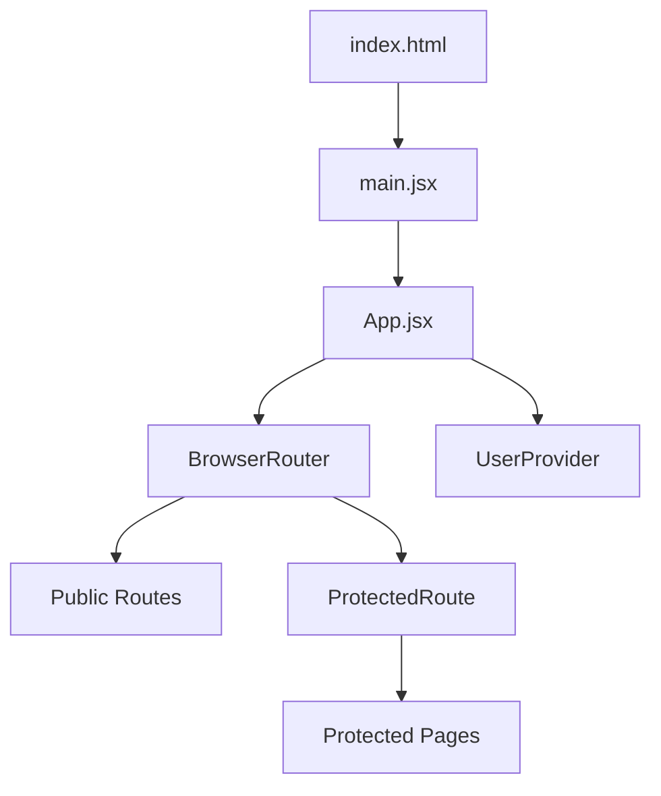

### Frontend Structure

- `frontend/src/main.jsx`
  - mounts the React app with `StrictMode`
- `frontend/src/App.jsx`
  - defines routes
  - wraps the app in `UserProvider`
- `frontend/src/api/axios.js`
  - shared axios client
  - injects `Authorization: Bearer <token>` from `localStorage`
- `frontend/src/routes/ProtectedRoute.jsx`
  - blocks access if no token
  - waits for user context
  - optionally enforces roles

### Main React Pages

#### Public pages

- `/login` -> `LoginPage`
- `/register` -> `RegisterPage`

#### Protected pages

- `/homepage` -> `HomePage`
- `/profile` -> `ProfilePage`
- `/driver` -> `DriverProfilePage`
- `/ride-offer` -> `RideOffersPage`
- `/ride-offer/create` -> `CreateRideOfferPage`
- `/ride-offer/:ride_offer_id/edit` -> `EditRideOfferPage`
- `/my-ride-offers` -> `MyRideOffersPage`
- `/ride-offer/:ride_offer_id/offer-requests` -> `RideOfferRequestPage`
- `/my-offer-requests` -> `MyOfferRequestsPage`
- `/ride-request` -> `RideRequestsPage`
- `/ride-request/create` -> `CreateRideRequestPage`
- `/my-ride-request` -> `MyRideRequestPage`
- `/my-request-response` -> `MyRequestResponsePage`
- `/my-messages` -> `MyMessagesPage`
- `/my-report-page` -> `MyReportsPage`

#### Admin-only protected page

- `/admin-reports` -> `AdminReportsPage`

### Frontend Route Protection

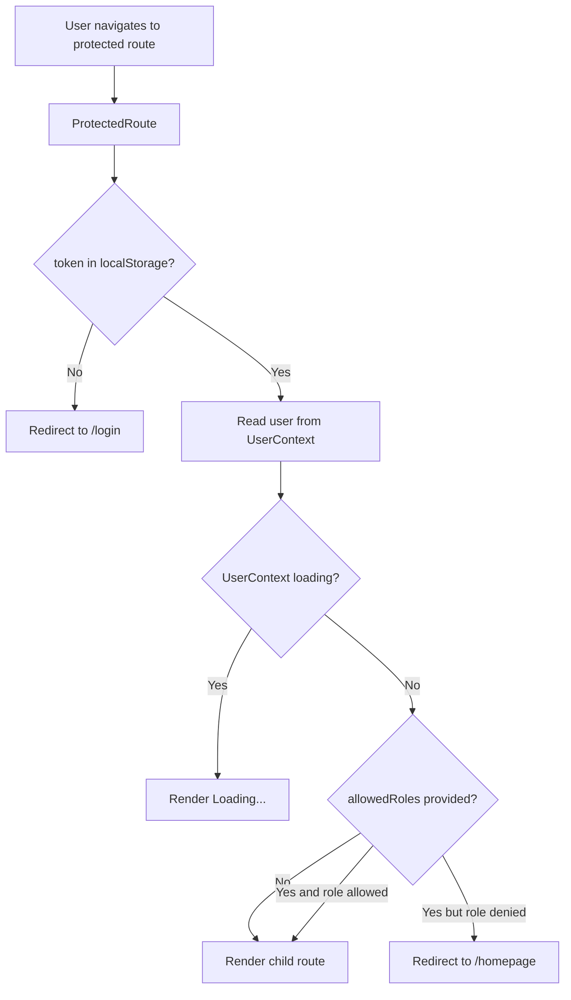

### Components / Forms / Modals

The frontend is feature-based and most interaction flows are driven by page state plus feature components.

#### Auth

- `LoginForm`
- `RegisterForm`

#### Ride offers

- `RideOfferForm`
- `RideOfferList`
- `RideOfferDetailsModal`
- `CreateOfferRequestModal`

#### Offer requests

- `OfferRequestForm`

#### Ride requests

- `RideRequestForm`
- `RideRequestList`
- `RideRequestDetailsModal`
- `CreateRequestResponseModal`

#### Request responses

- `RequestResponseForm`
- `RideRequestResponseModal`
- `RideRequestResponsesList`

#### Messages

- `CreateMessageForm`
- `CreateMessageModal`
- `MessageList`

#### Reports

- `CreateReportForm`
- `CreateReportModal`
- `ReportList`

#### Driver profile

- `DriverProfileForm`
- `DriverProfileCard`
- `DriverProfileEmptyState`

### Axios API Layer

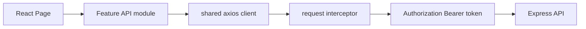

Feature API modules include:

- `features/auth/api/auth.api.js`
- `features/profile/api/profile.api.js`
- `features/driverProfile/api/driverProfile.api.js`
- `features/ride-offers/api/rideOffers.api.js`
- `features/offerRequests/api/offerRequests.api.js`
- `features/ride-request/api/rideRequests.api.js`
- `features/request-responses/api/requestResponses.api.js`
- `features/messages/api/messages.api.js`
- `features/reports/api/reports.api.js`

### Loading / Error State Pattern

Most pages follow this pattern:

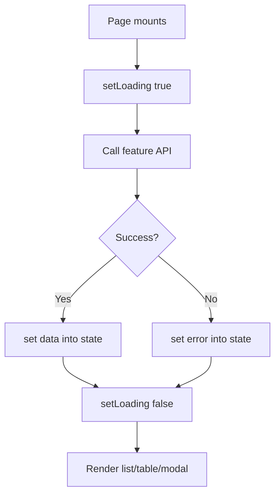

Observed frontend pattern:

- `useEffect` triggers initial fetch
- local `loading` state renders `Loading...`
- local `error` state renders inline error text
- selected item state drives modal visibility
- successful actions usually refetch the relevant list

### User Context Flow

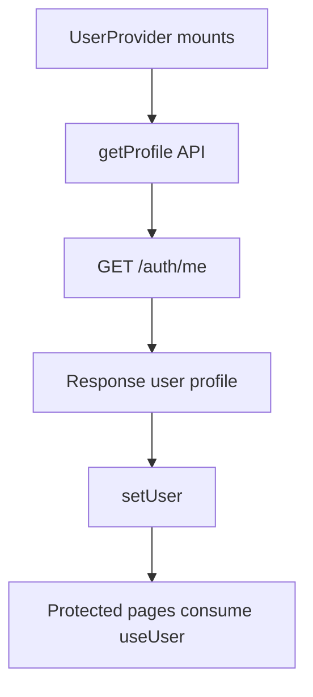

`UserContext` provides:

- `user`
- `setUser`
- `loading`
- `error`

---

## Backend Architecture

### Backend Entry Flow

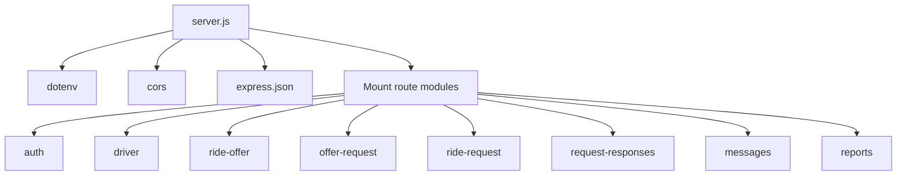

### Route Groups

- `/auth`
- `/driver`
- `/ride-offer`
- `/offer-request`
- `/ride-request`
- `/request-responses`
- `/messages`
- `/reports`

### Request Processing Pipeline

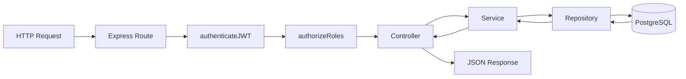

### Layer Responsibilities

#### Routes

- define endpoints
- attach auth and RBAC middleware
- dispatch to controllers

#### Middleware

- validate JWT
- enforce allowed roles

#### Controllers

- read `req.body`, `req.params`, `req.user`
- call services
- map service result codes to HTTP status codes

#### Services

- validate inputs
- enforce business rules
- check ownership and status transitions
- orchestrate repository calls

#### Repositories

- contain SQL queries
- read/write domain records
- join related tables for richer responses

#### Database access

- centralized in `backend/src/config/db.js`
- uses `pg.Pool`
- SSL toggled by env

---

## Auth Flow

### Login Flow

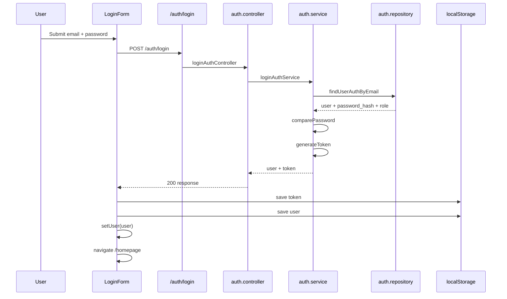

### JWT Flow

- backend generates JWT in `backend/src/utils/jwt.js`
- payload includes:
  - `user_id`
  - `email`
  - `role`
- secret comes from `JWT_SECRET`
- expiry comes from `JWT_EXPIRES_IN`

### localStorage Flow

Frontend login stores:

- `token`
- `user`

`ProtectedRoute` reads:

- `localStorage.getItem("token")`

Axios request interceptor reads:

- `localStorage.getItem("token")`

### Authorization Header Flow

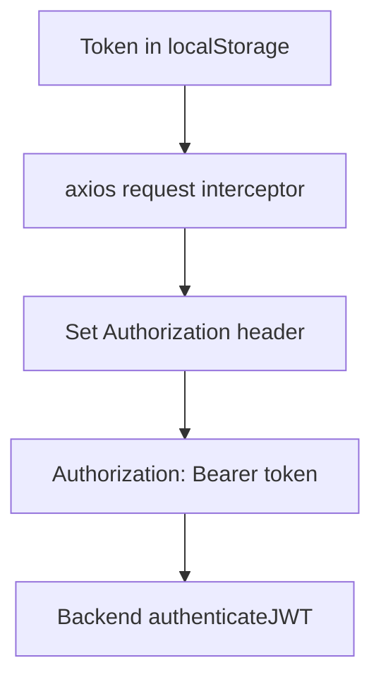

### `authenticateJWT`

Responsibilities:

- require `Authorization` header
- require `Bearer <token>` format
- verify token via `jsonwebtoken`
- attach decoded token to `req.user`
- require:
  - `req.user.user_id`
  - `req.user.email`
  - `req.user.role`

Failure outcomes include:

- token missing
- invalid header format
- invalid or expired token
- missing user ID
- missing email
- missing role

### `authorizeRoles`

Responsibilities:

- confirm `req.user.role` exists
- allow access only when role is in the configured allowed list

Role set used in source:

- `Admin`
- `Driver`
- `Passenger`

### RBAC Overview

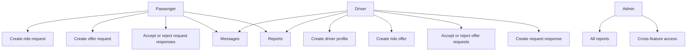

---

## Frontend Feature Flow

### Frontend Feature Map

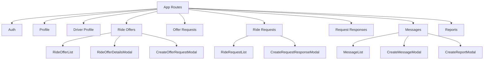

### Forms / Modals Interaction Pattern

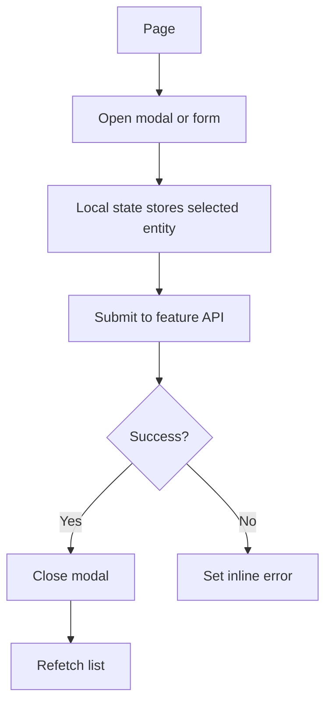

---

## Backend Module Map

### Backend Feature Map

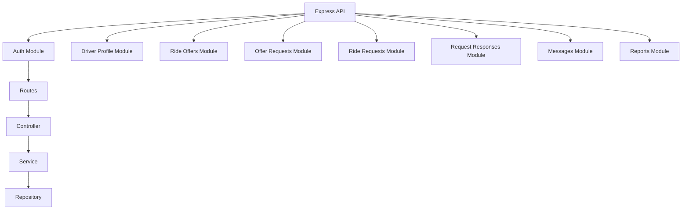

### Main Backend Modules

#### Auth

- register
- login
- get current user
- my-offer-requests
- my-request-responses
- my-messages
- my-reports
- my-driver-profile
- my-ride-request
- my-ride-offers

#### Driver profiles

- create driver profile
- get by user ID
- update driver profile

#### Ride offers

- create
- list all
- get by ID with driver info
- update
- cancel
- get offer requests for an offer

#### Offer requests

- create
- get by ID
- cancel
- accept
- reject

#### Ride requests

- create
- list all
- get by ID
- update
- cancel
- get request responses for a ride request

#### Request responses

- create
- get by ID
- get by ride request
- accept
- reject
- cancel

#### Messages

- create
- get by ID
- mark as read

#### Reports

- create
- get by ID
- admin list all

---

## Database / Domain Model

Repository and schema references show these core domain entities:

- `users`
- `roles`
- `driver_profiles`
- `ride_offers`
- `offer_requests`
- `ride_requests`
- `request_responses`
- `messages`
- `reports`

### Entity Relationship Overview

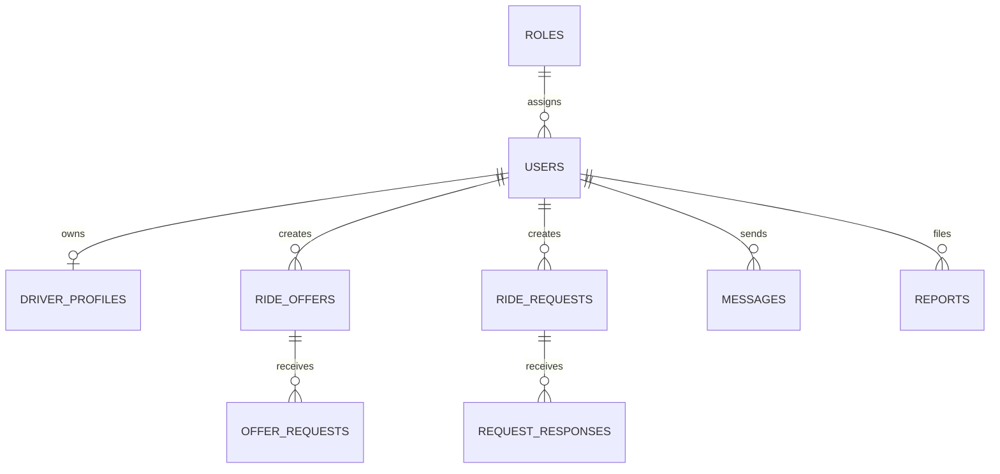

### Database Access Flow

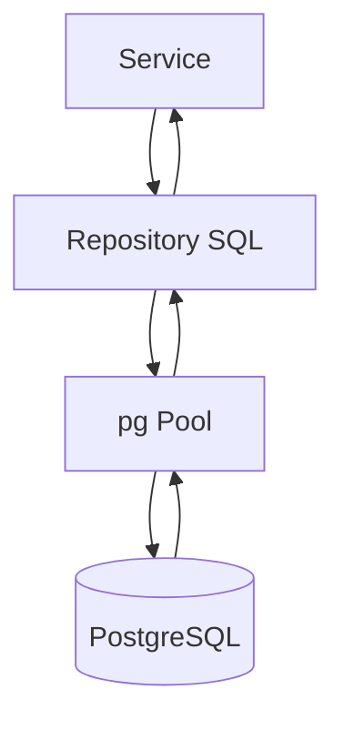

---

## Main Workflows

## 1. Create Ride Offer

### Frontend Flow

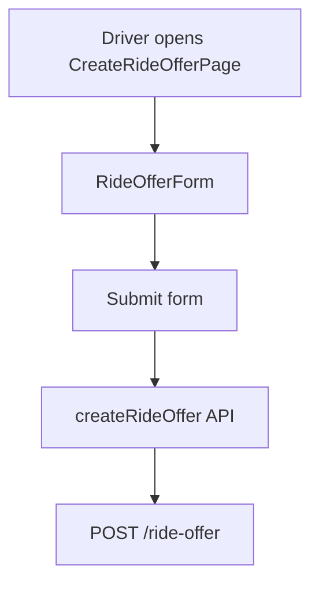

### Backend Flow

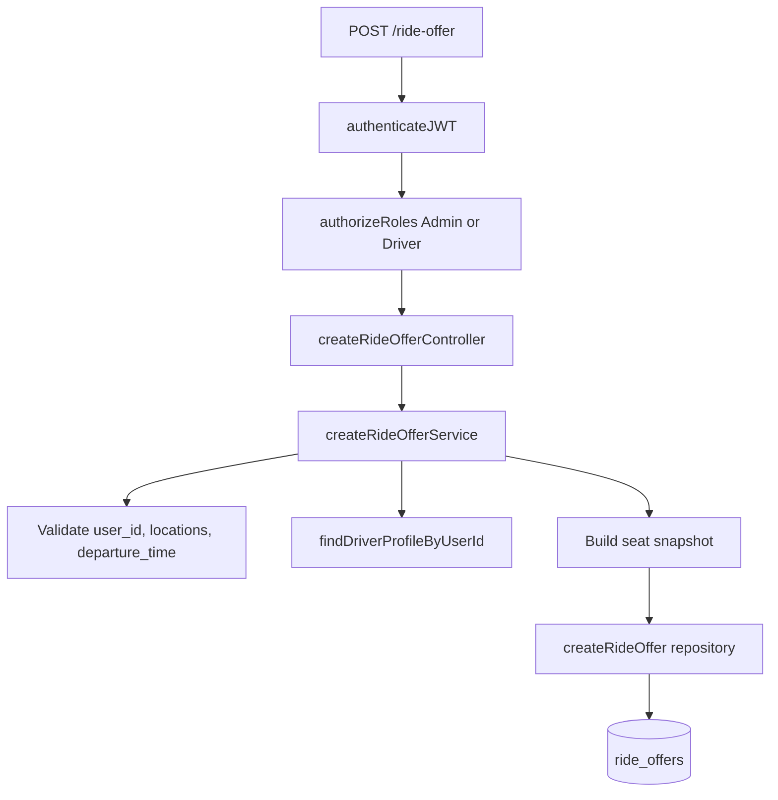

### Business Rules

- driver profile must exist
- pickup and dropoff must differ
- departure time must be in the future
- seat capacity snapshot comes from driver profile
- status starts as `open`

---

## 2. Create Offer Request

### Frontend Flow

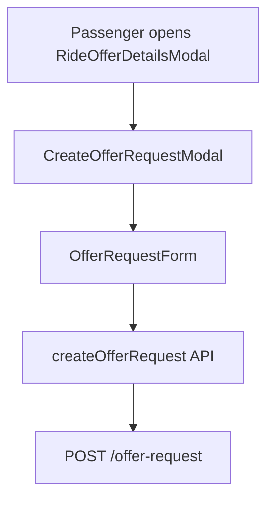

### Backend Flow

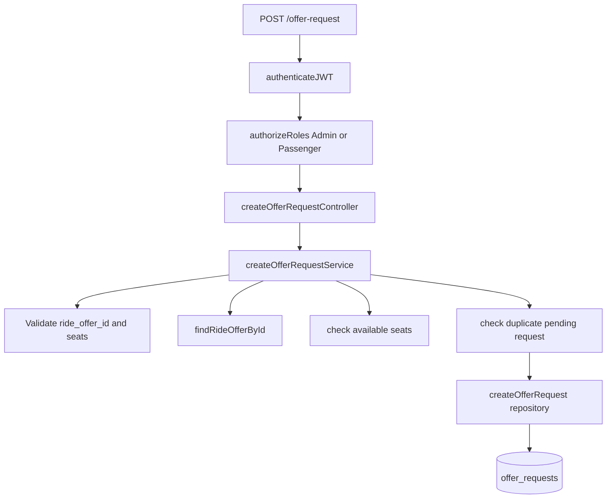

### Business Rules

- passenger cannot request own ride offer
- requested seats must be positive
- requested seats cannot exceed available seats
- ride offer must be `open`
- duplicate pending request is blocked

---

## 3. Accept / Reject Offer Request

### Frontend Flow

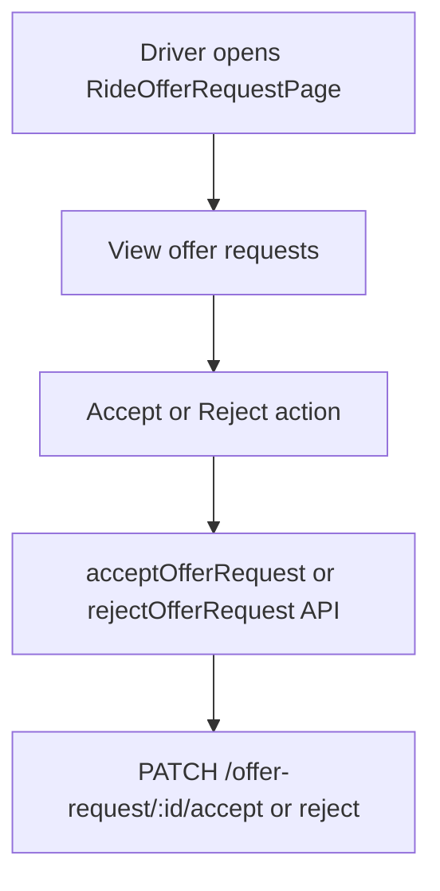

### Backend Flow

```mermaid
flowchart TD
  A[PATCH offer request status] --> B[authenticateJWT]
  B --> C[authorizeRoles Admin or Driver]
  C --> D[offer_requests.controller]
  D --> E[offer_requests.service]
  E --> F[check ownership of ride offer]
  E --> G[ensure request is pending]
  E --> H[updateOfferRequestStatus]
  E --> I[decreaseAvailableSeats on accept]
  E --> J[updateRideOfferStatus if needed]
```

### Business Rules

- only ride offer owner or admin can decide
- request must still be `pending`
- accepting can reduce available seats
- ride offer status can move toward `full`

---

## 4. Create Ride Request

### Frontend Flow

```mermaid
flowchart TD
  A[Passenger opens CreateRideRequestPage] --> B[RideRequestForm]
  B --> C[Submit form]
  C --> D[createRideRequest API]
  D --> E[POST /ride-request]
```

### Backend Flow

```mermaid
flowchart TD
  A[POST /ride-request] --> B[authenticateJWT]
  B --> C[authorizeRoles Admin or Passenger]
  C --> D[createRideRequestController]
  D --> E[createRideRequestService]
  E --> F[Validate rider_user_id, locations, seats, departure_time]
  F --> G[createRideRequest repository]
  G --> H[(ride_requests)]
```

### Business Rules

- pickup and dropoff must differ
- rider ID must be valid
- seats must be a positive integer
- notes are optional
- status defaults to `open`

---

## 5. Create Request Response

### Frontend Flow

```mermaid
flowchart TD
  A[Driver opens RideRequestsPage] --> B[Select ride request]
  B --> C[CreateRequestResponseModal]
  C --> D[RequestResponseForm]
  D --> E[createRequestResponse API]
  E --> F[POST /request-responses]
```

### Backend Flow

```mermaid
flowchart TD
  A[POST /request-responses] --> B[authenticateJWT]
  B --> C[authorizeRoles Admin or Driver]
  C --> D[createRequestResponseController]
  D --> E[createRequestResponseService]
  E --> F[getRideRequestById]
  E --> G[ensure request is open]
  E --> H[ensure driver is not rider]
  E --> I[check duplicate response]
  E --> J[driverExists]
  J --> K[createRequestResponse repository]
  K --> L[(request_responses)]
```

### Business Rules

- ride request must exist and be `open`
- driver cannot respond to own ride request
- duplicate pending response is blocked
- driver profile must exist

---

## 6. Create Message

### Frontend Flow

```mermaid
flowchart TD
  A[User opens message modal] --> B[CreateMessageModal]
  B --> C[CreateMessageForm]
  C --> D[createMessage API]
  D --> E[POST /messages]
```

Message creation is triggered from:

- accepted ride offer request flow
- accepted ride request response flow
- reply flow inside `MyMessagesPage`

### Backend Flow

```mermaid
flowchart TD
  A[POST /messages] --> B[authenticateJWT]
  B --> C[authorizeRoles Admin, Passenger, Driver]
  C --> D[createMessageController]
  D --> E[createMessageService]
  E --> F[validate sender and receiver]
  E --> G[validate one context only]
  E --> H[verify ride-offer or ride-request relationship]
  H --> I[createMessage repository]
  I --> J[(messages)]
```

### Business Rules

- sender cannot equal receiver
- message text cannot be empty
- exactly one context must be supplied:
  - `ride_offer_id`
  - or `ride_request_id`
- sender/receiver pair must match a valid ride relationship

---

## 7. Create Report

### Frontend Flow

```mermaid
flowchart TD
  A[User opens CreateReportModal] --> B[CreateReportForm]
  B --> C[createReport API]
  C --> D[POST /reports]
```

Currently report creation is wired from message details in `MyMessagesPage`.

### Backend Flow

```mermaid
flowchart TD
  A[POST /reports] --> B[authenticateJWT]
  B --> C[authorizeRoles Admin, Passenger, Driver]
  C --> D[createReportController]
  D --> E[createReportService]
  E --> F[validate reporting user]
  E --> G[validate reason and details]
  E --> H[ensure exactly one target]
  E --> I[verify target exists]
  I --> J[createReport repository]
  J --> K[(reports)]
```

### Valid Report Targets

Exactly one of:

- `reported_user_id`
- `ride_offer_id`
- `ride_request_id`
- `message_id`

### Business Rules

- self-reporting is blocked for user-target reports
- reason is required
- target must exist
- status starts as `open`

---

## Route And RBAC Matrix

| Module | Endpoint pattern | Allowed roles |
|---|---|---|
| Auth | `/auth/register`, `/auth/login` | public |
| Auth | `/auth/me` | authenticated |
| Auth | `/auth/me/offer-requests` | `Passenger` |
| Auth | `/auth/me/request-responses` | `Driver` |
| Auth | `/auth/me/messages` | `Admin`, `Driver`, `Passenger` |
| Auth | `/auth/me/reports` | `Admin`, `Driver`, `Passenger` |
| Driver | `/driver` create/update/read | mostly authenticated, role-gated |
| Ride offers | `/ride-offer` create/update/cancel | `Admin`, `Driver` |
| Ride offers | `/ride-offer` read | `Admin`, `Driver`, `Passenger` |
| Offer requests | `/offer-request` create/cancel/read | `Admin`, `Passenger` |
| Offer requests | `/offer-request/:id/accept|reject` | `Admin`, `Driver` |
| Ride requests | `/ride-request` create/update/cancel | `Admin`, `Passenger` |
| Ride requests | `/ride-request` read | `Admin`, `Driver`, `Passenger` |
| Request responses | `/request-responses` create/cancel/read own | `Admin`, `Driver` |
| Request responses | `/request-responses/:id/accept|reject` | `Admin`, `Passenger` |
| Messages | `/messages` | `Admin`, `Driver`, `Passenger` |
| Reports | `/reports` create/get own | `Admin`, `Driver`, `Passenger` |
| Reports | `/reports` list all | `Admin` |

---

## Summary

TaraSabay uses a feature-based architecture on both client and server. The frontend is centered around React Router, modal-driven workflows, a shared axios client, and `UserContext`. The backend is structured around protected Express route modules backed by services and repositories, with JWT authentication and role-based authorization enforcing the main business flows for ride offers, offer requests, ride requests, request responses, messages, and reports.
